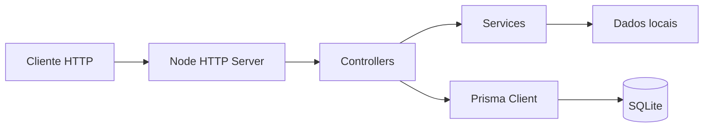

# Podcast API

API HTTP desenvolvida em TypeScript para listar, filtrar e cadastrar episódios de podcasts.

O projeto utiliza o módulo HTTP nativo do Node.js e Prisma com SQLite, sem framework web como Express.

## Tecnologias

- Node.js
- TypeScript
- Node HTTP
- Prisma ORM
- SQLite
- TSX
- tsup

## Arquitetura



## Estrutura

```text
podcast-api/
├── prisma/
│   ├── schema.prisma
│   └── seed.ts
├── src/
│   ├── controllers/
│   ├── data/
│   ├── services/
│   └── index.ts
├── .env
├── package.json
└── tsconfig.json
```

## Modelo de dados

O Prisma define a entidade `Podcast`:

```text
Podcast
├── id
├── podcastNAME
├── episode
├── videoID
└── categories
```

O banco SQLite é armazenado no diretório `prisma/`.

## Requisitos

- Node.js
- npm

## Configuração

Crie um `.env`:

```env
PORT=3005
```

É recomendado manter no Git apenas um `.env.example` e adicionar `.env` ao `.gitignore`.

## Como rodar

Clone:

```bash
git clone https://github.com/juankurtzzz/podcast-api.git
cd podcast-api
```

Instale:

```bash
npm install
```

Gere o Prisma Client:

```bash
npm run prisma:generate
```

Crie/aplique a migration:

```bash
npm run prisma:migrate
```

Opcionalmente, popule o banco:

```bash
npm run prisma:seed
```

Inicie em desenvolvimento:

```bash
npm run start:dev
```

API:

```text
http://localhost:3005
```

## Endpoints

### Listar episódios

```http
GET /api/list
```

### Filtrar episódio

```http
GET /api/episode
```

A implementação atual utiliza a camada `filterEpisodes` para a filtragem.

### Criar podcast

```http
POST /api/podcast
Content-Type: application/json
```

Exemplo:

```json
{
  "podcastNAME": "Fala, Dev!",
  "episode": "Nome do episódio",
  "videoID": "youtube-video-id",
  "categories": ["tecnologia", "programação"]
}
```

Campos obrigatórios:

- `podcastNAME`
- `episode`
- `videoID`

## Scripts

```bash
npm run start:dev
npm run dist
npm run prisma:generate
npm run prisma:migrate
npm run prisma:seed
```

### Build

```bash
npm run dist
```

O build é realizado pelo `tsup`.

> O script `run:dist` existente no `package.json` deve ser revisado antes de ser usado como comando oficial de produção, pois o caminho de saída precisa corresponder ao arquivo realmente gerado pelo `tsup`.

## Fluxo de uma requisição

```text
HTTP Request
   ↓
src/index.ts
   ↓
Controller
   ↓
Service / Prisma
   ↓
JSON Response
```

## Banco

Para visualizar e editar os dados pelo Prisma Studio:

```bash
npx prisma studio
```

## Desenvolvimento recomendado

Antes de publicar novas alterações:

```bash
npm run prisma:generate
npm run dist
```
